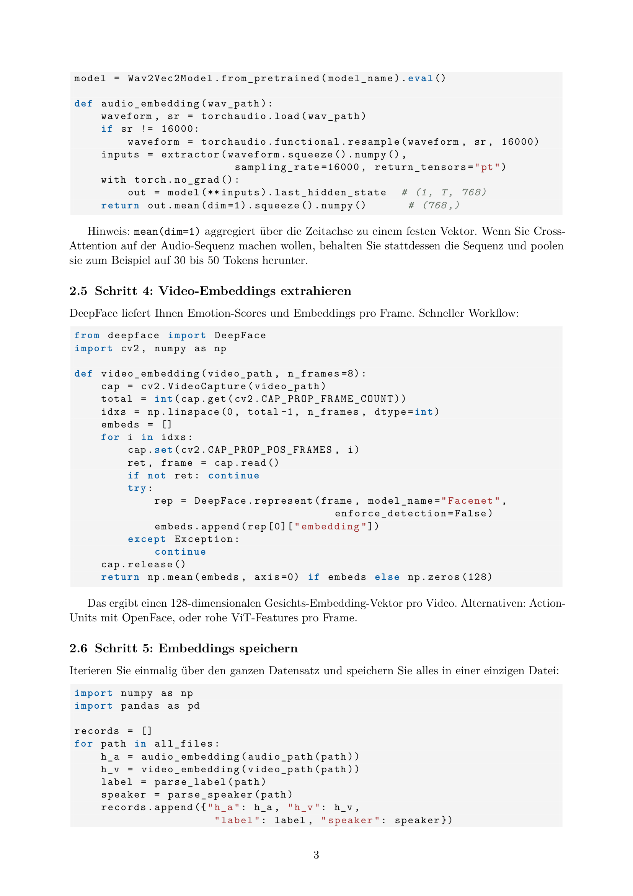
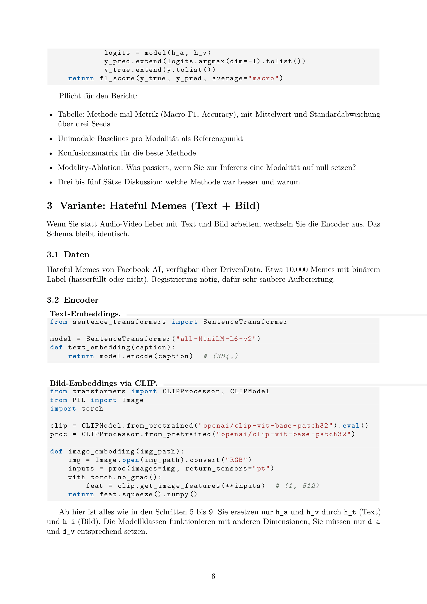
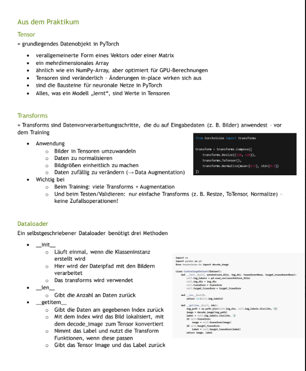

# EMI_Projekt

## Inhaltsverzeichnis
- [Setup](#setup)
- [Ergebnistabelle](#ergebnistabelle)
- [Diskussion](#diskussion)
- [Aufgabenstellung](#aufgabenstellung)
  - [Todo Liste](#todo-liste)
  - [Aufgabenstellung File](#aufgabenstellung-file)
- [Planung](#planung)
- [Shell Commands](#shell-commands)
- [Notizen](#notizen)

## Setup

Klonen des Repositorys:
````shell
git clone https://github.com/Bekky95/EMI_Projekt.git
````

Virtuellen Enviroment erstellen und aktivieren:
````shell
# create virtual enviroment /.venv :
python3 -m venv .venv

#activate virtual enviroment:
source .venv/bin/activate
````

Benötigte Pakete installieren:
````shell
pip install -r .\requirements.txt
````

Nach dem Klonen muss nur die `main.py` gestartet werden und das komplette Training wird ausgeführt.
Beim Starten wird geprüft ob das Datenset bereits im Verzeichnis ist, wenn nicht, wird dieses heruntergeladen.
Ansonsten wird das Datenset aus dem Verzeichnis `./data/dataset<Dataset_name_>` geladen. Es muss also kein Datenset manuell geladen werden

## Ergebnistabelle
tbd

<table>
<tr>
    <th style="text-align:left;"> 
    -
    </th>
    <th style="text-align:left;">
    Cross-Attention
    </th>
    <th style="text-align:left;">
    Early Fusion
    </th>
</tr> 

<tr>
    <th style="text-align:left;"> 
    Ergebnisse
    </th>
    <th style="text-align:left;">
    Text 1
    </th>
    <th style="text-align:left;">
    Text 2
    </th>
</tr>

<tr>
    <th style="text-align:left;"> 
    Vorteile
    </th>
    <th style="text-align:left;">
    Text 3
    </th>
    <th style="text-align:left;">
    Text 4
    </th>
</tr>

<tr>
    <th style="text-align:left;"> 
    Nachteile
    </th>
    <th style="text-align:left;">
    Text 5
    </th>
    <th style="text-align:left;">
    Text 6
    </th>
</tr>

</table>

## Diskussion
tbd

## Aufgabenstellung

Implementieren Sie ein multimodales Klassifikationssystem mit mindestens zwei der in der Vorle-
sung behandelten Fusionsmethoden. Vergleichen Sie die Methoden experimentell und dokumentieren
Sie Ihre Ergebnisse im Code-Repository. \
Ausführlich in [Section File](#aufgabenstellung-file)

### Todo Liste
- [x] Setup in Readme schreiben
- [ ] Ergebnistabelle in Readme schreiben
- [ ] Diskussion in Readme schreiben
- [ ] Dataset Klasse implementieren
- [ ] Modelle als Objekte anlegen (siehe Branch tryout)
  - [ ] Text: sentence-transformers/all-MiniLM-L6-v2 384
  - [ ] Bild: openai/clip-vit-base-patch32 512
- [ ] Methoden als Objekte anlegen (siehe Branch tryout)
  - Cross-Attention (uni- oder bidirektional)
  - Early Fusion (Konkatenation, optional mit Projektion auf gemeinsame Dimension)
- [ ] Alles in der main.py aufrufen

### Aufgabenstellung File








## Planung
````mermaid
---
config:
  theme: 'default'
---
classDiagram
    class ExtractFeatures{
    }
    
    class Train{
        
    }
    
    class main{
    }
    
    ExtractFeatures --> main
    Train --> main
````

## Shell Commands

````shell
pip install -r .\requirements.txt
````

````shell
# create virtual enviroment /.venv :
python3 -m venv .venv

#activate virtual enviroment:
source .venv/bin/activate
````

## Notizen
[Link zu kompletter file](https://drive.google.com/file/d/1EV2VbuiWD4vl9lH4-UF3MYNqR8OsZ8pY/view?usp=drive_link)




Beispiel mit korrektem Aufruf der Bilder aus dem Datensatz yay

````python
import matplotlib.pyplot as plt
import random

from extract_features import ExtractFeaturesHuggingface

if __name__ == "__main__":

  extract_features = ExtractFeaturesHuggingface()
  datensatz = extract_features.load_dataset_from_dir()

  fig, axes = plt.subplots(2, 7, figsize=(14, 5))
  axes = axes.flatten()

  indices = random.sample(range(len(datensatz['train'])), 14)

  for ax, idx in zip(axes, indices):
    img = datensatz['train'][idx]['images'][0]
    label = datensatz['train'][idx]['messages'][0]['content']

    ax.imshow(img, cmap='gray')
    ax.set_title(label)
    ax.axis("off")

  plt.tight_layout()
  plt.show()
````

# How to Automate Kaggle Dataset Downloads with Python
[Link zu Medium Tutorial](https://medium.com/data-science-collective/how-to-automate-kaggle-dataset-downloads-with-python-f0788710fb5c)

## Step 1: Setting up the API

First, you need to install the Kaggle Python package:

````shell
pip install kaggle
````
Then, create an API token:

- Go to your Kaggle account settings: Settings.
- Scroll down to the API section and click Create New API Token.
- This will download a kaggle.json file containing your username and API key.

Move this file to the following location (depending on your operating system):

- Linux/Mac: ~/.kaggle/
- Windows: C:\Users\<YourUsername>\.kaggle\

Ensure that the file permissions are secure:

````shell
chmod 600 ~/.kaggle/kaggle.json
````

## Step 2: Downloading the Dataset

To download the entire dataset as a ZIP file:

(insert the dataset which you want  to download)

````shell
kaggle datasets download -d heptapod/titanic
````

If you prefer to do it directly from Python:

````python
import kaggle

# Download the Titanic dataset
kaggle.api.dataset_download_files('heptapod/titanic', path='data/', unzip=True)
````

Now, the Titanic dataset will be stored in the data/ directory, and the ZIP file will be automatically extracted.

## Listing Dataset Files

To see which files are included in the dataset, use:

````python
# List files in the Titanic dataset
files = kaggle.api.dataset_list_files('heptapod/titanic')

print(files)
````

Output:

````
Dataset URL: https://www.kaggle.com/datasets/heptapod/titanic
[{"ref": "", "datasetRef": "", "ownerRef": "", "name": "train_and_test2.csv", "creationDate": "2019-09-20T15:44:27.234Z", "description": "", "fileType": "", "url": "", "totalBytes": 83879, "columns": []}]
````

## Searching for Datasets

````python
# Search for datasets related to cars
datasets = kaggle.api.dataset_list(search="cars")
for dataset in datasets:
    print(f"{dataset.title} - {dataset.ref}")
````

