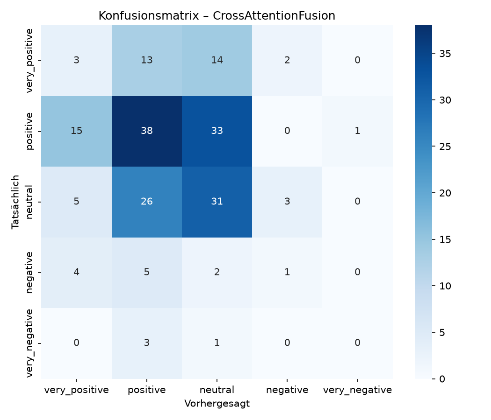

# EMI_Projekt

## Inhaltsverzeichnis
- [Setup](#setup)
- [Ergebnistabelle](#ergebnistabelle)
- [Diskussion](#diskussion)
  - [Die Methoden](#die-methoden)
  - [Macro-F1 und Accuracy](#macro-f1-und-accuracy)
  - [Lernverhalten und Overfitting](#lernverhalten-und-overfitting)
  - [Modalitäts-Ablation](#modalitäts-ablation)
  - [Stabilität über verschiedene Seeds](#stabilität-über-verschiedene-seeds)
  - [Zusammenfassung und Limitationen](#zusammenfassung-und-limitationen)


## Setup

Klonen des Repositorys:
````shell
git clone https://github.com/rahelBlub/EMI_Project.git
````

Virtuellen Enviroment erstellen und aktivieren:
````shell
# create virtual enviroment /.venv :
python3 -m venv .venv

#activate virtual enviroment:
source .venv/bin/activate
````

Benötigte Pakete installieren:
````shell
pip install -r .\requirements.txt
pip install git+https://github.com/openai/CLIP.git
````
CLIP package von GitHub: https://github.com/openai/CLIP/tree/main

Nach dem Klonen muss zuerst die `extract_features.py` gestartet werden.
Beim Starten wird geprüft ob das Datenset bereits im Verzeichnis ist, wenn nicht, wird dieses heruntergeladen.
Ansonsten wird das Datenset aus dem Verzeichnis `./data/dataset<Dataset_name_>` geladen. Es muss also kein Datenset manuell geladen werden

````bash
python extract_features.py
````
Anschließend muss die `models.py` gestartet werden. Das reicht einmalig, dann sind diese fest.

````bash
python models.py
````
Zum Schluss folgt dann noch die `train.py` mit dem Training und der Auswerung der Daten.

````bash
python train.py
````

## Ergebnistabelle





| Methode               | 	Macro-F1        | 	Accuracy         |
|-----------------------|------------------|-------------------|
| Baseline Text only    | 	0.2362          | 	0.4050           |
| Baseline Image only   | 	0.1974          | 	0.3400           |
| EarlyFusion           | 	0.2078 ± 0.0064 | 	0.3583 ± 0.0118  |
| CrossAttentionFusion	 | 0.2302 ± 0.0107  | 	0.3667 ± 0.0062  |

**Modalitäts-Ablation (nur für bestes Modell - CrossAttention):** \
Ohne Text  : F1 = 0.2055  (Rückgang: +0.0247) \
Ohne Image : F1 = 0.2392  (Rückgang: -0.0091)

**Unimodale Baselines:** \
Unimodale Baseline (Text): F1=0.2362, Acc=0.4050 \
Unimodale Baseline (Bild): F1=0.1974, Acc=0.3400

## Diskussion

### Die Methoden

Es werden zwei multimodale Fusionsstrategien verglichen:

- **EarlyFusion**: Die Merkmale (Features) aus Text- und Bild-Encoder werden direkt nach der Extraktion aneinandergehängt (concatenated) und 
dann in einen gemeinsamen Klassifikator gegeben. 
  - Vorteil: einfach und schnell. 
  - Nachteil: Die Modalitäten können nicht gezielt aufeinander abgestimmt werden, relevante Bild-Text-Beziehungen müssen vom Klassifikator 
  allein gelernt werden, was bei kleinen Datenmengen oft nicht gelingt.

- **CrossAttentionFusion**: Hier wird ein Attention-Mechanismus eingesetzt. Das bedeutet: Das Modell lernt für jedes Textelement 
(z.B. ein Wort), welche Bildregionen dazu passen, und umgekehrt. Es entsteht eine gewichtete Kreuzmodal-Repräsentation, ähnlich 
wie ein Mensch beim Betrachten eines Memes automatisch Blickbeziehungen zwischen Text und Bild herstellt.
  - Vorteil: flexibel 
  - Nachteil: rechenintensiver


### Macro-F1 und Accuracy

- **Accuracy**: Ist der Anteil korrekter Vorhersagen. Es ist ein einfaches Maß, aber bei unbalancierten Datensätzen irreführend, eine Klasse mit vielen 
Beispielen dominiert das Ergebnis.

- **Macro-F1**: Der F1-Score ist das harmonische Mittel aus Precision und Recall und wird für *jede Klasse einzeln* berechnet und dann gemittelt. 
Eine seltene Klasse hat hier dasselbe Gewicht wie eine häufige. **Macro-F1 ist daher aussagekräftiger, wenn die Klassenverteilung ungleich 
ist** – was bei Memotion (mehrere Emotionskategorien) typischerweise der Fall ist.

- **Klassenverteilung**: auch *Class Distribution* oder *Label Distribution* beschreibt, wie viele Beispiele es pro Kategorie in deinem Datensatz gibt.
Beispiel: ein Memotion-Datensatz hat 1000 Memes mit diesen Emotionslabels:
  - *humorous* (lustig): 500 Memes
  - *sarcastic* (sarkastisch): 200 Memes
  - *offensive* (beleidigend): 150 Memes
  - *motivational* (motivierend): 100 Memes
  - *neutral*: 50 Memes
    - → ungleiche Klassenverteilung (imbalanced) → Klasse *humorous* kommt häufiger vor als die anderen
      - Das ist für die Auswertung wichtig, weil **Accuracy** misst nur „Wie viele aller Vorhersagen waren richtig?", ein Modell könnte hohe Accuracys 
      erreichen durch das Raten von *humorous*, die restlichen Klassen würden vernachlässigt werden. **Macro-F1** berechnet den F1-Score getrennt für 
      jede Klasse und mittelt dann. Eine seltenere Klasse zählt so genauso viel wie die große Klasse, wodurch Macro-F1 bei ungleichen Klassen
      aussagekräftiger ist
      - In unseren Ergebnissen hat die Text-Baseline hat eine höhere Accuracy (0.4050), aber CrossAttentionFusion liegt im Macro-F1 fast gleichauf (0.2302 vs. 0.2362)
        - → CrossAttentionFusion macht zwar insgesamt etwas mehr Fehler, aber diese Fehler verteilen sich gleichmäßiger über alle Klassen, da die
        kleinen Klassen nicht ignoriert werden

- **Unimodale Text-Baseline**: hat die höchste Accuracy. Aber: Die Accuracy wird vermutlich von
einer großen, leichter klassifizierbaren Klasse getrieben. **CrossAttentionFusion liegt im Macro-F1 fast gleichauf mit der 
Text-Baseline (0.2302 vs. 0.2362)**, obwohl die Accuracy niedriger ist. Das bedeutet: CrossAttentionFusion verteilt seine Vorhersagen *ausgewogener* 
über die Klassen. EarlyFusion bleibt mit 0.2078 klar zurück, einfaches Concatenaten reicht nicht, um die Modalitäten sinnvoll zu kombinieren.

| Methode               | 	Macro-F1        | 	Accuracy         |
|-----------------------|------------------|-------------------|
| Baseline Text only    | 	0.2362          | 	0.4050           |
| Baseline Image only   | 	0.1974          | 	0.3400           |
| EarlyFusion           | 	0.2078 ± 0.0064 | 	0.3583 ± 0.0118  |
| CrossAttentionFusion	 | 0.2302 ± 0.0107  | 	0.3667 ± 0.0062  |

### Lernverhalten und Overfitting

Die Loss- und Val-F1-Verläufe über die Epochen zeigen ein klares Muster:

- **EarlyFusion** (Seed 42): Start-Loss 0.1484 → fällt auf 0.0206. Der Val-F1 steigt bis Epoche 10 (0.2029), fällt dann aber kontinuierlich 
auf 0.1936 in Epoche 40. Das Modell **overfittet**, es lernt die Trainingsdaten auswendig, verallgemeinert aber nicht mehr.
- **CrossAttentionFusion** (Seed 42): Start-Loss 0.4212 (deutlich höher, weil die Kreuz-Attention-Parameter erst lernen müssen, welche 
Modalitäten aufeinander bezogen werden) → fällt auf 0.0592. Der Val-F1 steigt bis Epoche 20 auf **0.2548**, das ist der höchste Val-F1 
überhaupt im gesamten Experiment, und fällt dann ebenfalls ab.

CrossAttentionFusion braucht länger zum Lernen, erreicht aber ein höheres Val-F1-Maximum, bevor auch hier das Overfitting einsetzt. 
Das spricht dafür, dass **die Cross-Attention tatsächlich sinnvolle modalitätsübergreifende Muster extrahiert**, die EarlyFusion nicht finden kann.

### Modalitäts-Ablation

Die Ablation wurde nur für das beste Modell (CrossAttentionFusion) durchgeführt:

| Bedingung                   | F1      | Veränderung zu CrossAttentionFusion |
|-----------------------------|---------|-------------------------------------|
| Volles CrossAttentionFusion | ~0.2302 | –                                   |
| Ohne Text                   | 0.2055  | **−0.0247**                         |
| Ohne Bild                   | 0.2392  | **+0.0091**                         |

- **Ohne Text bricht die Leistung ein** (−0.0247): Der Text ist die dominante Modalität. Memes leben stark von ihrer Textkomponente
(Wortspiele, Übertreibungen, Ironie), das Bild allein reicht nicht.
- **Ohne Bild steigt der F1 leicht** (+0.0091): Das klingt kontraintuitiv, ist aber ein bekanntes Phänomen. Die Bildmerkmale 
scheinen teilweise *Rauschen* beizutragen, das Modell wird durch irrelevante visuelle Details abgelenkt. CrossAttentionFusion
kann das teilweise kompensieren (besser als EarlyFusion), aber nicht vollständig. Mögliche Ursachen: zu einfacher Bild-Encoder, 
kleine Datenmenge, oder viele Memes, bei denen das Bild nur dekorativ ist.

### Stabilität über verschiedene Seeds

Die **Standardabweichung der Accuracy** ist ein Maß für die Robustheit des Modells gegenüber zufälligen Initialisierungen:

- **EarlyFusion**: ±0.0118
- **CrossAttentionFusion**: ±0.0062

CrossAttentionFusion ist fast doppelt so stabil. → Das Modell liefert reproduzierbarere Ergebnisse und ist weniger 
Glück bei der Initialisierung ausgeliefert.

### Zusammenfassung und Limitationen

**Warum CrossAttention besser ist:**
1. Höherer Macro-F1 bei ausgewogenerer Klassifikation
2. Lernverhalten zeigt echte Kreuzmodal-Interaktion (höheres Val-F1-Maximum)
3. Deutlich stabiler über Seeds
4. Ablation bestätigt, dass beide Modalitäten genutzt werden (auch wenn Bild noch Rauschen beisteuert)

**Limitationen:**
- Die absoluten F1-Werte sind niedrig (alle unter 0.25), der Datensatz ist offenbar sehr schwer.
- Beide Modelle overfitten nach Epoche 20. Regularisierung (Dropout, Weight Decay) oder früheres Stoppen könnten helfen.
- Die Ablation (nur Bild oder nur Text) wurde nur für CrossAttentionFusion durchgeführt.
- Der Bild-Encoder war einfach (z. B. ein kleines CNN). Vortrainierte Modelle (ResNet, ViT) könnten die Bildrepräsentation verbessern.
- Die gewählten Labels wurden aufgrund ihrer Einfachheit ausgewählt, die anderen Labels zu verwenden könnten die Werte nochmal etwas verändern

---


